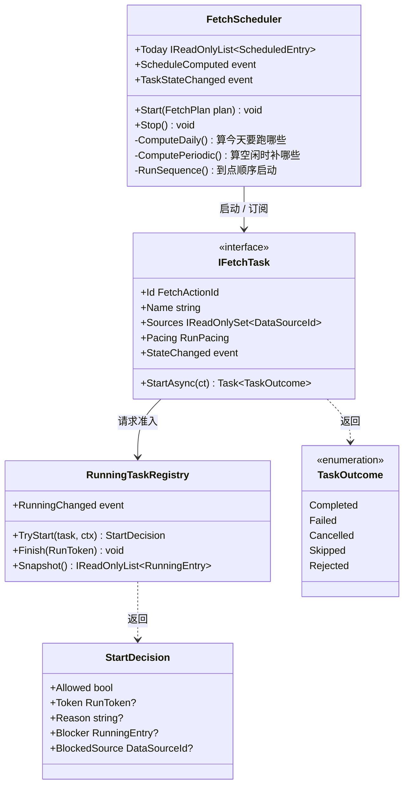

# 任务调度重构设计

> 2026-09-05 讨论定稿的架构方向。可视化版（含可勾选的待定项）：
> https://claude.ai/code/artifact/15bb3b6f-a4da-4c8d-9d50-934f706fd8ec
>
> ⚠ **这是方向，不是施工图。** 六个待定点还没拍板，落地按最后一节的分步走，
> 不要一次性替换 `PlanRunner`。

---

## 为什么要动

现在的调度散在三处，谁也不完整：

| 在哪 | 管什么 | 问题 |
|---|---|---|
| `PlanRunner` | 挑今天该跑哪一项、硬超时 | 让路判断（`IsSourceBusy`）混在 `IsPending` 里，分不清"没活了"和"被占着" |
| `MainViewModel.ExecutePlanItemAsync` | 排队、抢占、准入 | 调度逻辑长在 UI 层；`IsBusy` 这种布尔标志代表"手动页有大任务"，跟按源记账的占用表是两套并行的机制 |
| `SourceOccupancy` | 按数据源记账 | 只回答"能不能"，拒绝时带不出原因，界面只好说"没有待执行的项了" |

2026-09-05 的实际后果：手动跑【重新拉取失败】（当时没声明 `Sources`，`Mixed` 兜底成全部 9 个源），
计划停摆 2 小时 41 分，界面全程显示"今天没有待执行的项了"；期间两个空闲项排队 30 分钟后
被硬超时掐断、记成"失败"——它们一个请求都没发过。

---

## 三个类



### 职责边界

**`FetchScheduler`**（替代 `PlanRunner`）
- UI 点开始时 `Start(plan)` 把计划数据传进来——**不认识任何 UI 类型**
- 算完今天要跑什么发 `ScheduleComputed`，每日和定期**共用一个通知**、内容是全量快照
- 到点顺序启动任务、订阅任务状态、转发 `TaskStateChanged`

**`IFetchTask`**
- 自己会跑、会报状态。`StartAsync` 第一件事是问 registry 能不能跑
- 结束时返回 `TaskOutcome`。`Rejected`（准入没过、压根没开跑）必须跟 `Failed` 分开——
  记成 Failed 会让这一项今天不再自动重试

**`RunningTaskRegistry`**（`SourceOccupancy` 的演进）
- 任务主动问"我想启动"，返回 `StartDecision`
- **拒绝时要带上原因、被谁占着、撞的哪个源**——现在拿不到这些，界面才只能含糊其辞
- 加减都发 `RunningChanged` 全量快照

### 两条硬约束

1. **通知发全量快照，不发增量。** 订阅方拿到就是完整现状，不用自己拼状态；
   以后加通知类型或字段，订阅方不用改。
2. **准入是任务主动问的**，不是被别人挡在外面。这样"能不能跑"的判断只有一处。

---

## 六个待定点

| # | 问题 | 倾向 |
|---|---|---|
| ① | 串行还是并行 | 按顺序**发起**、不等上一个结束，能不能真跑由 registry 裁决。现在是源不冲突就并行（09-04 特意做的，串行时板块几天追不上时效性） |
| ② | 抢占裁决权归谁 | 调度类。它懂"这是到点的定时项"这类策略；registry 保持纯粹只管记账 |
| ③ | 40 个任务怎么变成对象 | 一个 `FetchTask` 通用类持有 action id + 委托，元数据从 `FetchTaskCatalog` 读。另一条路是 40 个具体类，更 OO 但要搬 40 处 |
| ④ | 谁写回计划文件 | 调度类。独立订阅者更"纯"，但多一处异步写文件的时序问题 |
| ⑤ | 计划跑到一半被改 | 算一次 + 提供「重新计算」入口。现在是每分钟重扫，中途改能很快生效 |
| ⑥ | 硬超时归谁 | 调度类。它订阅着任务、知道跑了多久；放任务基类里每个实现都要记得套 |

---

## 分步落地（重要）

**一次性替换 `PlanRunner` 风险太大**——它是无人值守的核心，出问题就是整晚不跑数据。
按下面走，每一步都能独立发布、独立回退，任何一步出事都不影响上一步已经稳定的部分。

### 第 1 步：`RunningTaskRegistry` 携带拒绝原因（最小、收益立现）

只做一件事：`SourceOccupancy.TryAcquire` 的返回值从 `RunningTask?` 换成 `StartDecision`，
带上 `Reason` / `Blocker` / `BlockedSource`。

- 现有两个调用点跟着改，行为不变
- 界面立刻能说清"在等谁、等哪个源"（这一步的价值已经在 09-05 的临时改动里验证过）
- **不碰** `PlanRunner`、不碰任务模型

### 第 2 步：`IFetchTask` 包装现有方法（纯增量）

加接口和一个 `FetchTask` 通用实现，把 `FetchOrchestrator` 那 40 个 `RunXxxAsync` 包进去。

- `PlanRunner` **照旧跑**，只是它调的东西换了层皮
- 元数据继续从 `FetchTaskCatalog` 读，不搬家
- 这一步做完，任务才有"自己会跑、会报状态"这个前提

### 第 3 步：`FetchScheduler` 与 `PlanRunner` 并存，配置切换

新调度类写出来，但**默认仍走 `PlanRunner`**。`fetcher-settings.json` 加一个开关：

```jsonc
"Scheduler": "legacy",   // 默认，走 PlanRunner
//"Scheduler": "new",    // 走 FetchScheduler
```

跟板块通道那套是同一个路子（见 `feedback_datasource_per_class`）：两套并存、配置切换、
出事一行配置退回去，不用等下一版程序。

- 两条路都得跑通同一份计划，结果要一致——这一步的验收标准就是"切过去跑一整天，
  跟前一天的日志对得上"
- 抢占（第 3 批那套）在新调度类里实现，旧的不动

### 第 4 步：观察一到两周后删掉 `PlanRunner`

确认新调度稳定、没有回退过，再删旧代码和那个开关。

### 每一步都要有的

- **端到端验证**：Debug 起程序、UIAutomation 点按钮、读界面日志（见 `feedback_verify_by_running_app`）。
  单元测试测不出调用环路——09-05 那次 98 个测试全绿而【东财验证】按钮死锁，就是教训
- **不改行为的步骤要有等价性测试**：新旧两条路喂同样输入，结果必须一样
  （参考 `BoardFetcherChannelParityTests` 的做法）

---

## 暂时不做

- **Debug 模式 mock 网络**（用户 09-05 提过）：等 `IFetchTask` 落地后再做，
  那时在任务层注入假实现比在传输层拦截干净得多
- **`IsBusy` 那套**：`AcquireOrPreemptAsync` 现在遇到 `IsBusy` 仍然只能让路。
  它代表【手动】页那几个横跨所有源的大按钮，要等它们也变成 `IFetchTask` 才能统一进 registry
