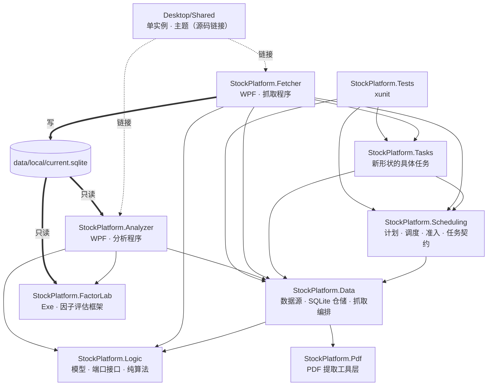
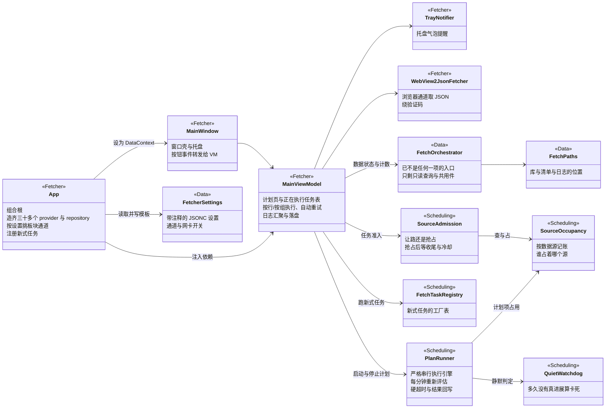
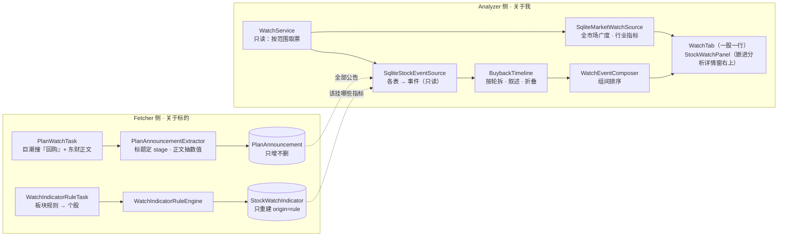
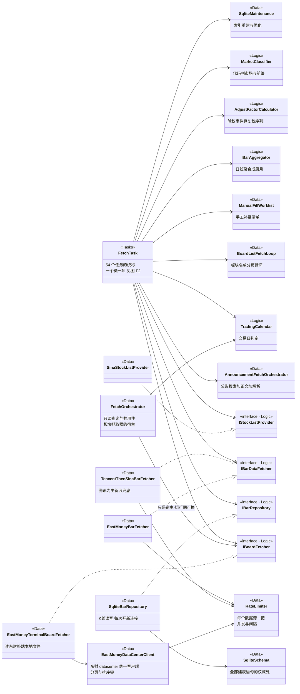
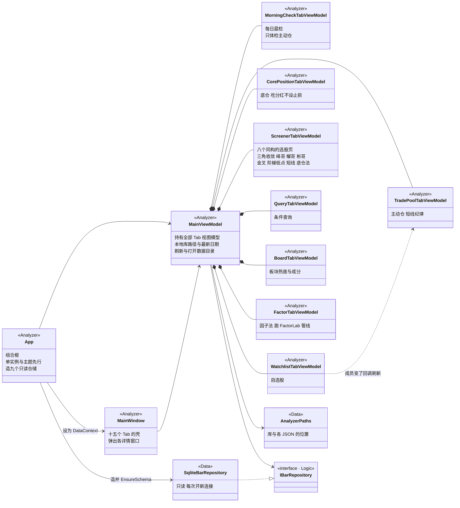
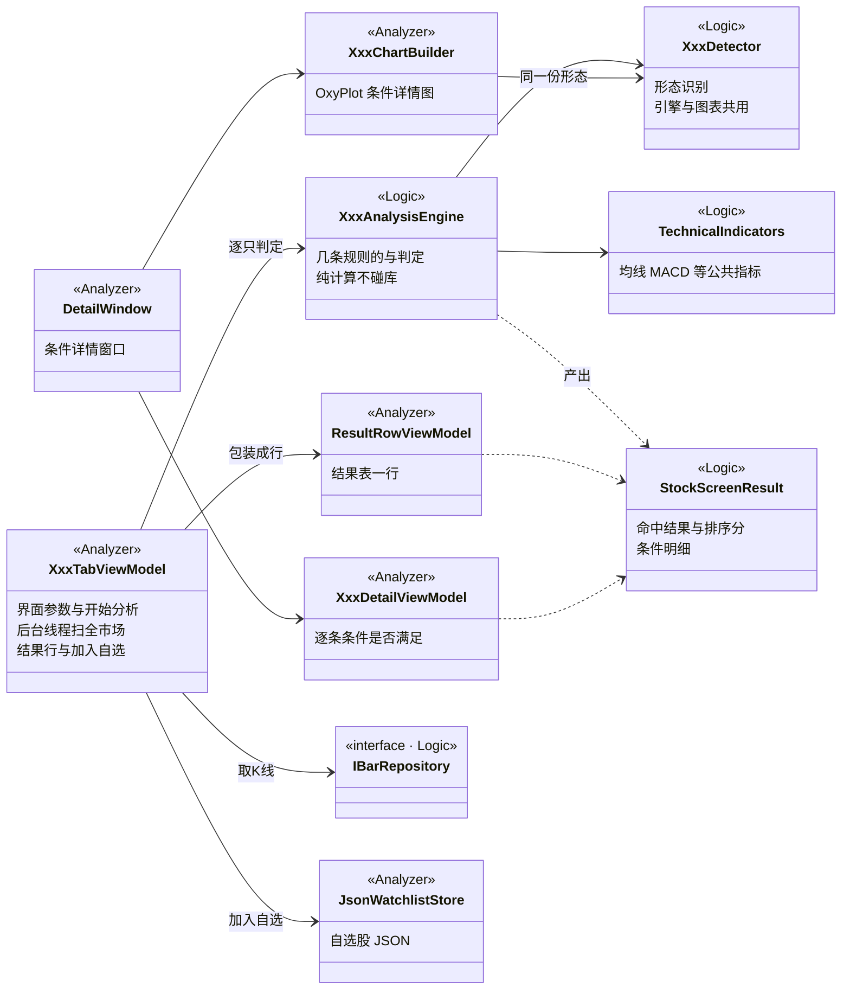
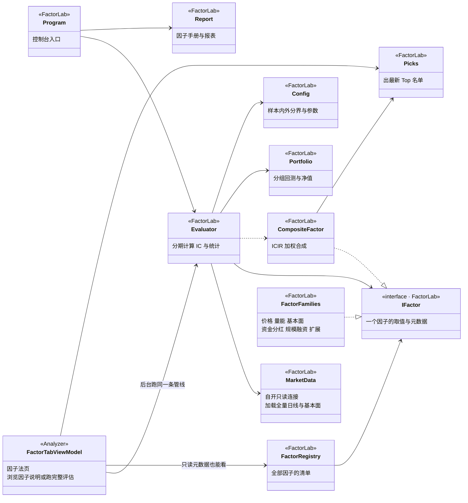

# Solution 类图 — 抓取与分析双线

> 2026-09-08 整理。可视化版（同样内容，图渲染好的）：
> https://claude.ai/code/artifact/6a66deb4-c954-40a4-910c-b1809799f409
>
> 这是**现状快照**，不是设计稿。跟具体机制相关的"为什么"仍以各类的类注释和
> [数据平台设计](data-platform-design.md)/[分析程序设计](analysis-app-design.md)/[调度重构](scheduler-redesign.md)为准。

同一个 Solution 里跑着两个互不通讯的程序：**Fetcher** 往 `current.sqlite` 里写，
**Analyzer** 只读同一个文件。八个项目按这条分界线各站一边，只有 Logic 和 Data 两层被两边共用。

---

## 0. 项目地图



| Project | 形态 | 职责 |
|---|---|---|
| **StockPlatform.Logic** | net8.0 类库 | **领域层，零依赖零 IO。** `Models/` 领域模型；`Abstractions/` 端口接口（IXxxFetcher · IXxxProvider · IXxxRepository，约 40 个）；`Services/` 纯算法（八种选股引擎、技术指标、复权、交易日历、市场分类）。两个程序都用，但子集几乎不重叠。 |
| **StockPlatform.Data** | net8.0 类库 | **适配层，Logic 那些接口的全部实现。** `Remote/` 数据源 HTTP 实现 + 限流；`Sqlite/` 仓储 + schema + 维护；`Local/` 读东财终端落盘文件；`Orchestration/` 抓取编排与路径/清单/设置。 |
| **StockPlatform.Pdf** | net8.0 类库 | **纯 PDF 工具层**（2026-09-11 从 Data 拆出）。PdfPig 取词+坐标聚类、pdftotext 兜底、Tesseract OCR 兜底，外加一个排兜底顺序的组合器。**准入规则：不认识"股票/代码/报告期/指标"任何一个概念**——所以 `BankReportParser` 不在这里，它留在 Data。零 ProjectReference，只依赖 PdfPig 包。 |
| **StockPlatform.Scheduling** | net8.0 类库 | **"什么时候跑什么"。** 计划模型与持久化、串行执行引擎、数据源占用与准入裁决、静默看门狗、新式任务契约与注册表。只有 Fetcher 用。 |
| **StockPlatform.Tasks** | net8.0 类库 | **新形状任务的落地处**（2026-09-08 起）。新任务一律在这继承 `FetchTaskBase` 写成独立类；**老任务按"迁移成本+维护成本"判断是否迁过来**（2026-09-10 起，原"老任务不迁"作废）。 |
| **StockPlatform.Fetcher** | WPF WinExe | 抓取程序：组合根 + 界面。**本身不含抓取逻辑**——造对象、按按钮、显示日志和计划表。 |
| **StockPlatform.Analyzer** | WPF WinExe | 分析程序：组合根 + 界面 + 图表 + 本地 JSON（自选/持仓/笔记）。**不联网、不写库。** |
| **StockPlatform.FactorLab** | net8.0 Exe | 因子评估框架，控制台可独立跑；Analyzer 的【因子法】页引用它的 `Core` 跑同一条管线。**自己开 `SqliteConnection` 只读，不走 Data 层仓储**——全 Solution 唯一一处。 |
| **Desktop/Shared** | 共享源码（非项目） | `SingleInstanceGuard`、`ThemeManager`/`ThemeBrushes`/`ThemeSwitcher` + 四份主题 XAML。两个 WPF 各 `<Compile Include>` 一份，不建项目、不共享程序集。 |
| **StockPlatform.Tests** | xunit | 引用 Data / Scheduling / Tasks。改 FetchPlan / PlanRunner 后要跑。 |

---

## 0.1 分层职责原则（2026-09-21 用户定）

**新写和迁移的代码一律按这条原则落位**；存量不一次性重构，**碰到哪一块就把那一块搬对**。

| 层 | 只做这件事 | 不该出现在这里的 |
|---|---|---|
| `Data/Remote`（含现在的 `Local/`） | **数据从哪来**——外部接口、终端落盘文件、离线模拟，加限流 | 判据、落库 |
| `Data/Sqlite` | **操作本地库**——读和写，仅此两样 | 判据（体检规则、修复规则、完整性规则） |
| `Logic`（`Models`/`Abstractions`/`Services`） | **模型、端口接口、纯算法判据**，零 IO | 任何 File / SqliteConnection / HttpClient |
| `StockPlatform.Tasks` | **一项任务干什么活**——把"读库 → 算判据 → 抓 → 算写入方案 → 写库"串起来 | 判据本体、SQL |
| `StockPlatform.Scheduling` | **什么时候跑什么**——计划、准入、占用、看门狗、任务契约 | 具体任务实现 |

两条推论，迁移时按它验收：

1. **判据不许住在 Sqlite 类里**。现在 `SqliteBarValueAuditor`、`SqliteDayCompletenessAuditor`、
   `SqliteAdjSeriesAuditor`、`SqliteMarginShortBalanceFiller` 这类"体检/修复"把**规则和 SQL 焊在一起**，
   正确形状是：Sqlite 读出原料 → Logic 的纯函数判 → Sqlite 写回结论。
   这样规则能单测、能被两个调用方共用，而不是"谁想复用就复制一份"。
2. **同一条判据全 Solution 只有一份**。老编排层和新任务可以各自编排，但**不能各判各的**——
   两份判据必然分叉，而这类分叉是静默的（见
   [盘中K线固化](bar-value-audit-design.md)、成交量单位两次事故）。

`Data/Remote` 与 `Data/Local` 按这条原则**应当合并**（`Local/` 只有一个文件，而 `Remote/` 里
本来就躺着三个读东财终端本地文件的类，分家纯属历史遗留）。合并本身不急，先记在这里。

---

## 1. Fetcher 方向

四层：**界面**（Fetcher）→ **调度**（Scheduling / Tasks）→ **编排**（Data.Orchestration）→
**数据源与存储**（Data.Remote / Data.Sqlite，落在 Logic 的接口上）。
界面层不认识任何 provider，编排层不认识任何界面类型。

⚠ **"编排"这一层 2026-09-22/23 基本退场了**：54 项抓取任务全部住在 Tasks 层
（一个类一项，见 `IFetchTask`），`FetchOrchestrator` 不再是任何一项的执行入口，
剩下的只有【数据状态】页的只读查询、财报那一段共用逻辑、板块抓取器的宿主和两个端口。
所以现在真正的主干是**界面 → 调度 → 任务 → 数据源与存储**，编排层是旁挂的。
整个过程见 [orchestrator-retirement.md](orchestrator-retirement.md)。

### 图 F1 · 主干：界面 → 调度 → 编排

启动路径只有一条（2026-09-08 起）：界面上的每个动作都是**计划里的一行**，计划引擎
`PlanRunner` 按时间表串行跑，人也可以按行【执行】或按组【执行整组】插一次。
两种触发都要先过 `SourceAdmission` 这道准入，否则会出现两个任务同时打同一家服务器、
同时写同一张表。（原来还有一条【手动】页按钮直调编排层 `RunXxxAsync` 的路，
连同那一页一起撤了——同一件事两套实现，改一边忘另一边是迟早的事。）



### 图 F2 · 计划与任务模型

计划文件里每一项都指向 `FetchActionId` 枚举；`FetchTaskCatalog` 是它的元数据字典——
这一项用哪几个数据源、算哪个配额组、要不要日期参数、属于哪个分组，**全在这一处**，
调度和界面都从这里读。右半边是 2026-09-08 落地的新任务形状。

```mermaid
classDiagram
direction TB

class FetchPlan {
  <<Scheduling>>
  一份计划的根
}
class FetchPlanGroup {
  <<Scheduling>>
  一组按顺序跑的项
}
class FetchPlanItem {
  <<Scheduling>>
  跑哪个动作
  不早于几点
  重复方式与上次结果
}
class FetchPlanStore {
  <<Scheduling>>
  计划文件读写
}
class FetchPlanTemplates {
  <<Scheduling>>
  预置计划模板
}
class FetchTaskCatalog {
  <<Scheduling>>
  动作元数据字典
  数据源与配额与参数与分组
}
class FetchActionInfo {
  <<Scheduling>>
  一条动作的元数据
}
class DataSourceCatalog {
  <<Scheduling>>
  数据源清单与显示名
}
class IFetchTask {
  <<interface · Scheduling>>
  自己会跑会报状态
  三路事件 进展 存活 状态
}
class FetchTaskBase {
  <<abstract · Scheduling>>
  泛型参数是一批的元素
  分批循环与取消收尾
  事件广播的公共骨架
}
class FetchTaskRegistry {
  <<Scheduling>>
  动作号到任务工厂
}
class TaskRunResult {
  <<record · Scheduling>>
  完成 无事可做 失败 停止
}
class TradingCalendarTask {
  <<Tasks>>
  拉深交所交易日历
  写 TradingDay 表
}
class DayCompletenessTask {
  <<Tasks>>
  日更末尾·当日完整性体检
  一批＝一段 K线/日更表/覆盖式快照
  产出的是待办不是数据
  不齐**不算自己失败**
}
class SqliteDayCompletenessAuditor {
  <<Data.Sqlite>>
  三段判据 + Apply 写待办
  两个调用方共用：
  这一项 / 重新拉取失败收尾重建
}
class SqliteMoneyFlowDayAudit {
  <<Data.Sqlite>>
  分档资金流当天齐不齐
  期望＝当天有日K的个股数
  快照任务收尾核对 + 界面那一格标红
}
class PlanRunner {
  <<Scheduling>>
}

FetchPlan *-- FetchPlanGroup
FetchPlanGroup *-- FetchPlanItem
FetchPlanStore --> FetchPlan : 存取
FetchPlanTemplates ..> FetchPlan : 生成
FetchPlanItem ..> FetchTaskCatalog : 查元数据
FetchTaskCatalog *-- FetchActionInfo
FetchActionInfo ..> DataSourceCatalog
PlanRunner --> FetchPlan : 挑今天该跑的
PlanRunner --> FetchPlanStore : 回写结果
FetchTaskBase ..|> IFetchTask
TradingCalendarTask --|> FetchTaskBase
PlanWatchTask --|> FetchTaskBase
WatchIndicatorRuleTask --|> FetchTaskBase
MoneyFlowSnapshotTask --|> FetchTaskBase
DayCompletenessTask --|> FetchTaskBase
DayCompletenessTask --> SqliteDayCompletenessAuditor : 跑三段判据
MoneyFlowSnapshotTask --> SqliteMoneyFlowDayAudit : 收尾回查库
MoneyFlowBackfillTask --|> FetchTaskBase
TotalSharesTask --|> FetchTaskBase
class ITotalSharesProvider {
  <<Logic.Abstractions>>
  全市场总股本(股)
  ⚠ 不是财报 share_capital
  那是实收资本·金额·元
}
class EastMoneyTotalSharesProvider {
  <<Data.Remote>>
  东财条件选股接口
  一个请求拿全市场 5562 只
}
class TotalSharesTask {
  <<Tasks>>
  日更·写 FundamentalMetric.total_shares
  护栏:北交所专项 + 半截名单
}
EastMoneyTotalSharesProvider ..|> ITotalSharesProvider
TotalSharesTask --> ITotalSharesProvider : 抓
TotalSharesTask --> ITradingDayRepository : 值归到交易日
FinancialAnalyzer ..> TotalSharesTask : PE/PB 的股数(缺则回退 share_capital 并标识)
EtfTurnoverRecalcTask --|> FetchTaskBase
class EtfTurnoverRecalcTask {
  <<Tasks>>
  按需·ETF换手率校正
  补份额→检查→(彻底重查)写回
  只写 turnover 一列
}
class SseEtfShareProvider {
  <<Data.Remote>>
  上交所每日ETF份额
  一天一个请求·2012-01-04起
}
class EtfTurnoverRule {
  <<Logic.Services>>
  成交量(手) ÷ 前一交易日份额(万份)
  一致/错值/空值/无法裁判
}
SseEtfShareProvider ..|> IEtfShareProvider
SqliteEtfShareRepository ..|> IEtfShareRepository
EtfTurnoverRecalcTask --> IEtfShareProvider : 补份额
EtfTurnoverRecalcTask --> IEtfShareRepository : EtfShare 表
EtfTurnoverRecalcTask --> SqliteEtfTurnoverStore : 按只读写 Bar.turnover
EtfTurnoverRecalcTask ..> EtfTurnoverRule : 判据
class SqliteMarketPeSource {
  <<Data.Sqlite>>
  一次读全市场 PE 的四份输入
  日线只捞45天:全表GROUP BY要4秒
}
class IndustryPeStatsBuilder {
  <<Logic.Services>>
  二级样本>=30带档/>=10只中位/否则退一级
  PE口径必须与个股行一致
}
class IndustryPeStats {
  <<Logic.Models>>
  行业名·级别·样本数·五分位
  措辞只说高低不说便宜贵
}
IndustryPeStatsBuilder --> IndustryPeStats : 产出
IndustryPeStatsBuilder ..> SqliteMarketPeSource : 输入由调用方取
FinancialAnalyzer ..> IndustryPeStats : PE行参考值(行业+全市场两段)
SqliteMarketPeSource ..> FinancialAnalyzer : 复用 TtmFromCumulative 保口径
class IMoneyFlowDetailFetcher {
  <<Logic.Abstractions>>
  逐股分档资金流的取数通道
  URL/解析共用 MoneyFlowKlineParser
  阈值·收尾措辞由通道自报
}
class EastMoneyMoneyFlowProvider {
  <<Data.Remote>>
  HttpClient 直连
  本机被网关按域名拦死
}
class ChromeCdpMoneyFlowFetcher {
  <<Data.Remote>>
  真 Chrome/Edge 里做 JSONP
  已验证可用·默认
}
EastMoneyMoneyFlowProvider ..|> IMoneyFlowDetailFetcher
ChromeCdpMoneyFlowFetcher ..|> IMoneyFlowDetailFetcher
ChromeCdpMoneyFlowFetcher --> ChromeCdpLauncher : 起浏览器·连 CDP
MoneyFlowBackfillTask --> IMoneyFlowDetailFetcher : 二选一(MoneyFlowBackfillTransport)
FetchTaskRegistry --> IFetchTask : 按动作号造
IFetchTask ..> TaskRunResult : 返回
```



### 图 F2b · 观察项那条线（2026-09-11）

设计见 [观察项设计](watch-item-design.md)。分界线是**这条知识属于标的还是属于我**：
左边（Fetcher / `current.sqlite`）是关于标的的，右边（Analyzer）是关于我的仓位和判断。



⚠ **2026-09-15：规则引擎 / 求值器 / 触发落库整套退休**（见设计文档）。
它服务的推送/日报出口从来没做过；观察项页改成事件叙述后，那两份 json 也没了界面。
现在 Analyzer 这侧只剩一条路：`WatchService` 按范围取票 → `SqliteStockEventSource` 读事件。
**`WatchIndicatorRuleEngine`（Fetcher 侧，名字像但不是同一条线）保留**——
碳酸锂能出现在宁德行里全靠它。

**三个关键不变量**（每一条都防一类静默事故）：
`StockWatchIndicator` 只重建 `origin='rule'`（手挂的不动）·
`WatchItem.Origin=手写` 任何规则不碰 ·
`PlanAnnouncement` 只增不删（方案结束摘的是待办，不是事实）。

**单票视图 2026-09-14 合并进【分析详情】**：观察项不再是独立窗口，
而是 `FinancialAnalysisWindow` 右栏上半部分的 `StockWatchPanel`——
左边财务、右上事件、右下趋势，同屏可对照。13 个列表页与行情详情窗的入口收敛成一颗【分析详情】。
⚠ 只是**布局**合并，两边内容各自不变（用户 2026-09-14 明确：不是要合并财务分析和观察项）。

**两条取值路径故意不合并**（2026-09-14 叙述式改版，见设计文档 §8.1）：
`SqliteWatchReadingSource` 是给**求值**用的——取一个数、判要不要触发、要不要提醒；
`SqliteStockEventSource` 是给**阅读**用的——把来龙去脉讲成人话。
两者取同一批表但形状完全不同，合成一个会互相将就。

### 图 F3 · 数据源与存储

抓取方**只认 Logic 里的接口**，具体是新浪还是东财由 App 组装时决定
（一次运行只用一个数据源，不做自动混用和故障切换）。这里每类接口只画代表实现。

⚠ 2026-09-23 更新：这张图原来画的是 `FetchOrchestrator` 指向各接口——那是编排层还在逐标的
抓取的年代。现在连这些接口的是**各个任务**（`StockDayBarTask` → `IBarDataFetcher`、
`BoardMemberTask` → `IBoardFetcher`…），编排层只剩下板块抓取器的宿主和几处只读查询。
任务与接口的对应关系在图 F2，这里只画接口与实现那一侧。



### Fetcher 方向 · 类职责

| 类 | Project | 职责 |
|---|---|---|
| `App` | Fetcher | 组合根。造出全部 provider / repository / 限流器，按 `fetcher-settings.json` 决定板块走哪个通道、绑哪张网卡，注册新式任务，最后把 `FetchOrchestrator` 和数据源列表交给 VM。另外拦 UI 未处理异常（抓了几小时不能因为点错一下就没了）。 |
| `MainWindow` | Fetcher | 窗口壳。托盘图标、最小化行为、几个直接事件处理；业务全转给 VM。 |
| `MainViewModel`（约 2400 行） | Fetcher | 界面状态机。【计划】页分组与项、按行/按组执行、正在执行任务表、日志缓冲与落盘、自动重试、数据源切换。**唯一同时认识调度层和编排层的类。** |
| `PlanItemViewModel` / `PlanGroupViewModel` / `RunningTaskViewModel` | Fetcher | 行视图模型：一条计划项 / 一个分组 / 一个正在跑的任务（已用时、占着哪些源、能不能停）。 |
| `WebView2JsonFetcher` | Fetcher | 浏览器通道：用 WebView2 带真实浏览器上下文取 JSON，对付纯 HTTP 会被拦的接口。放 Fetcher 是因为依赖 WPF 宿主。 |
| `TrayNotifier` · `LogText` · `RelayCommand` · 两个 Converter | Fetcher | 托盘气泡、日志文本行为、命令与值转换器。 |
| `PlanRunner` | Scheduling | 计划执行引擎：严格串行、"不早于"语义、每分钟重评估（边跑边改一分钟内生效）、跑完继续待命。管硬超时与结果回写。 |
| `SourceOccupancy` | Scheduling | 数据源占用表：谁占着哪几个源、拿它的取消源。只记账不做策略。 |
| `SourceAdmission` | Scheduling | 准入裁决：拿不到源时让路还是抢占——只有**定时项**能抢占，抢占后最多等 2 分钟收尾，等不到就放弃这一轮绝不硬上；同一被抢者 5 分钟冷却防拉锯。只做决定，不碰 UI。 |
| `QuietWatchdog` | Scheduling | 静默看门狗：吃"真进展"信号判卡死。刻意**不**吃"我还活着"的定时播报——卡在写锁上时那种播报照样按时吐。 |
| `FetchPlan` / `FetchPlanGroup` / `FetchPlanItem` | Scheduling | 计划数据模型三层。项上带动作号、不早于时刻、重复方式、节奏、上次结果与时间。 |
| `FetchPlanStore` · `FetchPlanTemplates` | Scheduling | 计划文件读写；预置模板（一键铺一套日常计划）。 |
| `FetchTaskCatalog` · `FetchActionInfo` · `DataSourceCatalog` | Scheduling | 动作元数据的**唯一权威处**：数据源、配额组、参数、全量/增量、数据就绪度、界面分组。加动作只改这一处。 |
| `IFetchTask` · `FetchTaskBase<TItem>` · `FetchTaskRegistry` | Scheduling | 新式任务契约（2026-09-08）：任务自己会跑、广播三路事件（真进展 / 存活播报 / 状态变化），停止＝取消 token 后 finally 收尾。**准入归调度侧**，任务只判断自己才知道的前提并返回 `NothingToDo`。 |
| `TradingCalendarTask` | Tasks | 目前唯一的新形状任务：抓深交所官方交易日历写 `TradingDay` 表，逐日回补靠它跳过节假日。 |
| `FetchOrchestrator`（833 行） | Data | **已经不是任何一项的执行入口**（2026-09-22 最后 7 项迁完，09-23 清掉死代码，从 3004 行降到这里）。现在剩四类东西：①【数据状态】页的只读查询（`GetDataStatus` / `GetRetryBacklog` / 一串 `GetPendingXxxCount`）；② 财报那一段（`FetchFinancialsForCodesAsync` / `GetFinancialFetchPlan`，【金融监管指标】要先补那几家的财报，两项共用同一份计划判据）；③ 板块抓取器的宿主（`ReplaceBoardFetcher`——`BoardMemberChannel` 决定造哪个类、什么限流参数，运行期【重新读取配置】要换掉它）；④ 两个给任务用的端口（`Liveness` / `TaskRunner`）。**别再往这里加任务**——新任务是 Tasks 层一个类 + 注册表一行。 |
| `AnnouncementFetchOrchestrator` · `BoardListFetchLoop` | Data | 两条自成一体的子流程：公告（巨潮搜索→东财正文→解析入库）、板块名单分页循环。 |
| `FetchPaths` · `FetcherSettings` · `JsonManifestStore` · `Heartbeat` · `ProgressThrottle` · `FetchResult` · `FailedRetrySummary` · `ManualFillWorklist` | Data | 编排层配套件：路径、JSONC 设置、水位线清单、心跳、进度节流、运行结果、失败重试汇总、手工补录清单。 |
| `Data.Remote`（约 60 个类） | Data | 数据源实现，按"一个数据源/通道一个类"拆：新浪系（K线/财务/分红/股东/指数成分/市值/ETF，龙虎榜留作后备）、东财系（datacenter 客户端 + 预测/龙虎榜概要/龙虎榜席位/资金流/事件/板块映射/行业指标/客户供应商，板块另有 HTTP、页面、终端文件三通道并存）、腾讯 K线、交易所直连（融资/退市名单/深交所日历）、中证权重、巨潮公告与预约。公共件：`RateLimiter`、`NetworkInterfaceBinder`、`EastMoneyJson`、`EastMoneyClistPage`。PDF 提取已于 2026-09-11 拆去 `StockPlatform.Pdf`，这里只剩业务解析 `BankReportParser`（给页面判据 + 从行里取数）。 |
| `Data.Sqlite`（约 40 个类） | Data | 仓储实现，一张（组）表一个类。`SqliteSchema` 是 schema 权威处；`SqliteMaintenance` 管索引与优化；`SqliteMissingBarRepository`/`SqliteDailyTableAuditor` 做缺口与覆盖体检，`SqliteDayCompletenessAuditor`（当天该有的都查一遍）和 `SqliteMoneyFlowDayAudit`（分档资金流当天齐不齐）是日更末尾那两道；`SqliteStockDossierReader` 是给分析程序按表直读的旁路。 |
| `Logic.Services`（抓取侧） | Logic | `BarAggregator`、`AdjustFactorCalculator`、`TradingCalendar`、`MarketClassifier`、`BoardIndexSynthesizer`、`ProbeFloorPlanner`、`DailyBackfillGate`、`YearGapCalculator`/`CalendarYearSlicer`、`CoverageShapeAuditor`、`IndexCatalog`/`MarketIndexCatalog`、`OrderWinExtractor`、`PartnerNameMatcher`、`LimitUpClassifier`。全部纯计算，抽出来就是为了能被单测钉住。 |

> ✅ **原来那处耦合已解除（2026-09-08）**：【手动】页那几个横跨所有数据源的大按钮不进占用表，
> `SourceAdmission` 只能靠 `manualBigTaskRunning` 这个布尔量给它们让路。那一页撤掉之后
> **占用表就是唯一的账本**，没有账外任务，那个参数和 `MainViewModel.IsBusy` 一起删了。

---

## 2. Analyzer 方向

形状跟 Fetcher 完全不同：没有调度、没有数据源，是一棵 **MainViewModel → 十五个 Tab VM** 的
扇出树。每个 Tab 自己决定读哪几个仓储、调哪个分析引擎。跨 Tab 共享的只有四样：
`AnalyzerPaths`、`IBarRepository`、`JsonWatchlistStore`、费率与仓位设置。

### 图 A1 · 主干：组合根 → Tab 扇出



### 图 A2 · 一个选股法的五件套（八个法子都是这个形状）

Analyzer 里最值得记住的模式：**Tab VM 负责参数与调度，Engine 负责判定，Detector 抽出形态识别
让图表和规则共用同一份，ChartBuilder 画条件详情图，DetailWindow 展示**。
图表和引擎共用 Detector 是刻意的——否则图文会对不上。



八个法子各自的落位（类名描述**算法本身**，跟界面中文 Tab 名是一一对应但不同名的两套叫法）：

| Tab | Engine（Logic） | Detector（Logic） | Chart / Detail（Analyzer） |
|---|---|---|---|
| 三角收敛 | `TriangleConvergenceAnalysisEngine` | `TriangleConvergenceDetector` | `TriangleConvergenceChartBuilder` / `TriangleConvergenceDetailWindow` |
| 峰哥法 | `FoundationAnalysisEngine` | — | `FoundationChartBuilder` / `FoundationDetailViewModel` + `DetailWindow` |
| 耀哥法 | `BottomReboundAnalysisEngine` | `BottomReboundPatternDetector` | `BottomReboundChartBuilder` / `BottomReboundDetailWindow` |
| 彬哥法 | `MidCapPullbackAnalysisEngine` | — | `MidCapPullbackChartBuilder` / `MidCapPullbackDetailWindow` |
| 金叉法 | `GoldenCrossAnalysisEngine` | — | `GoldenCrossChartBuilder` / `GoldenCrossDetailWindow` |
| 阶梯低点法 | `RisingLowsAnalysisEngine` + `MarketEnvironmentCalculator`（宽度/热度）+ `CutoffBarRepository`（按历史日期截断验证） | `RisingLowsDetector` | `RisingLowsChartBuilder` / `RisingLowsDetailWindow` |
| 短线法 | `ShortTermAnalysisEngine` + `TradeDiscipline`（止盈止损默认幅度） | — | 复用 `DetailWindow` |
| 底仓法 | `CorePositionAnalysisEngine` + `DividendMetrics`（股息率口径） | — | `CorePositionChartBuilder` / `CorePositionCriteriaWindow` |

### 图 A3 · 持仓、自选与本地文件

分析程序**不写数据库**，自己的状态全在几个 JSON 里。两层仓位刻意用两套文件、两套列：
主动仓看止亏价和 ±10%，底仓看股息率、连续分红、累计已收股息、免税到期日——
晨检那套短线纪律绝不能误伤底仓。

```mermaid
classDiagram
direction TB

> **分层边界（2026-09-15 重构）**：自选/持仓这条线原先整个长在 Analyzer 项目里，
> 想给它写单元测试就得让测试项目引用一个 WPF 项目。现已按**碰不碰文件 IO**拆开——
> 模型与纯计算（`WatchlistEntry` / `TradeLot` / `TradeCostSummary` / `CorePosition` /
> `TradeFeeSettings` / `PositionSizingSettings`）进 `Logic.Models`，
> 落盘的 `Json*Store` / `*Store` 留在 Analyzer。
> ⚠ **Logic 层零文件 IO 是硬纪律**，别把带 `File.ReadAll/WriteAll` 的类挪进去。
> JSON 兼容性不受影响：`JsonSerializerOptions` 只设了 `WriteIndented`，不写类型名，
> 换命名空间老数据照样读（已拿真实的 62 条自选 / 6 条底仓实机验证过）。

class AnalyzerPaths {
  <<Data>>
  库 自选 底仓 费率 仓位 笔记的位置
}
class JsonWatchlistStore {
  <<Analyzer>>
  自选股整体读改写
}
class WatchlistEntry {
  <<Logic.Models>>
  一只自选股
  是否进主动仓
}
class CriterionSnapshot {
  <<Logic.Models>>
  加入当时的条件快照
}
class TradeLot {
  <<Logic.Models>>
  一笔买卖
}
class TradeFeeSettings {
  <<Logic.Models>>
  佣金过户费印花税的费率
}
class TradeFeeStore {
  <<Analyzer>>
  费率落盘 全程序一份
}
TradeFeeStore --> TradeFeeSettings : 读写
class TradeCostSummary {
  <<Logic.Models>>
  成本与盈亏汇总
}
class JsonCorePositionStore {
  <<Analyzer>>
  底仓文件
}
class CorePosition {
  <<Logic.Models>>
  一只底仓持仓
}
class PositionSizingSettings {
  <<Logic.Models>>
  可投资金 凯利折扣 单票上限
}
class PositionSizingStore {
  <<Analyzer>>
  仓位参数落盘
}
PositionSizingStore --> PositionSizingSettings : 读写
class KellyPositionSizer {
  <<Logic>>
  凯利仓位计算
}
class StockNoteStore {
  <<Analyzer>>
  个股分析笔记
}
class TradePoolTabViewModel {
  <<Analyzer>>
}
class WatchlistTabViewModel {
  <<Analyzer>>
}
class CorePositionTabViewModel {
  <<Analyzer>>
}
class MorningCheckTabViewModel {
  <<Analyzer>>
}
class StyleGauge {
  <<Logic>>
  风格温度计
}

AnalyzerPaths ..> JsonWatchlistStore
AnalyzerPaths ..> JsonCorePositionStore
AnalyzerPaths ..> TradeFeeStore
AnalyzerPaths ..> PositionSizingStore
AnalyzerPaths ..> StockNoteStore
JsonWatchlistStore *-- WatchlistEntry
WatchlistEntry *-- CriterionSnapshot
WatchlistEntry *-- TradeLot
JsonCorePositionStore *-- CorePosition
WatchlistTabViewModel --> JsonWatchlistStore
TradePoolTabViewModel --> JsonWatchlistStore
TradePoolTabViewModel --> TradeFeeStore
TradePoolTabViewModel ..> TradeCostSummary
CorePositionTabViewModel --> JsonCorePositionStore
MorningCheckTabViewModel --> JsonWatchlistStore : 只体检主动仓
MorningCheckTabViewModel --> StyleGauge
PositionSizingStore ..> KellyPositionSizer
```

### 图 A4 · 因子法：Analyzer 直接调 FactorLab

唯一一处跨过 Data 层的读法：`FactorLab.Core.MarketData` 自己开只读 SQLite 连接加载全量日线。
界面版和控制台版跑的是同一条管线，输出必须一致。



### Analyzer 方向 · 类职责（选股法五件套见上表）

| 类 | Project | 职责 |
|---|---|---|
| `App` | Analyzer | 组合根。单实例守卫与主题必须在任何窗口创建之前（否则启动闪白），然后造九个 Sqlite 仓储（K线/基本面/资金流/板块/股东/融资/财务/分红/指数成分）交给 VM。 |
| `MainWindow` | Analyzer | 十五个 Tab 的壳，以及全部弹窗的打开点：行情详情、财务分析、个股档案、分红历史、仓位计算器、交易记录、代码规则、分析笔记。 |
| `MainViewModel` | Analyzer | 根 VM。持有全部 Tab VM 与三个全程序单例（费率、仓位参数、笔记库），暴露本地库路径与"数据最新到哪天"，提供刷新与打开数据目录。Tab 间联动的回调接在这里。 |
| `MorningCheckTabViewModel` | Analyzer | 每日晨检：只体检主动仓那一小撮票（底仓刻意不进），配 `StyleGauge` 出风格温度计。**纯手动刷新**——自动跑会拖垮启动和切页。 |
| `TradePoolTabViewModel` / `WatchlistTabViewModel` | Analyzer | 主动仓与自选股。共用同一份 `watchlist.json`，靠 `WatchlistEntry.IsInTradePool` 区分，成员变化互相回调刷新。 |
| `CorePositionTabViewModel` / `CorePositionScreenTabViewModel` | Analyzer | 底仓（持仓记录，看股息率与累计已收股息）与底仓法（选股）。底仓单独存 `core-positions.json`。 |
| `QueryTabViewModel` / `BoardTabViewModel` / `FactorTabViewModel` | Analyzer | 非选股法的三个页：条件查询、板块热度与成分、因子法。 |
| `ResultRowViewModel` · `ISelectableRow` | Analyzer | 各结果表共用的行模型与勾选接口——"加入自选/主动仓"这类批量操作靠它统一。 |
| 九个 `*ChartBuilder` · `ChartTheme` · `ChartAxisSync` · `QuoteChartBuilder` · `DossierChartBuilder` | Analyzer | OxyPlot 图表构建。`ChartTheme` 单独挂钩子跟随明暗主题（图表不是 WPF 画刷、跟不了 DynamicResource）；`ChartAxisSync` 同步多面板横轴。 |
| 各 `*DetailWindow` / `*DetailViewModel` · `CriterionDisplay` | Analyzer | 条件详情：逐条列出"这只票为什么入选"，配合同一份 Detector 画出的图。 |
| `StockDossierWindow` · `FinancialAnalysisWindow` · `QuoteDetailWindow` · `DividendHistoryWindow` · `PositionSizingWindow` · `TradeLotsWindow` | Analyzer | 六个工具窗口：个股档案（按表直读十几张表）、财务分析（含银行/券商专用体检）、行情详情（可叠加大盘）、分红历史、仓位计算器、交易记录录入。 |
| `GridExporter` · `XlsxWriter` · `TextFitter` · `IndustryClassifier` | Analyzer | 导出与显示辅助：表格导出 xlsx、文本裁切、证监会行业名归类。 |
| `Logic.Services`（分析侧） | Logic | 八个 `*AnalysisEngine` 与三个 Detector、`TechnicalIndicators`、`MarketEnvironmentCalculator`、`CutoffBarRepository`、`StyleGauge`、`TradeDiscipline`、`DividendMetrics`、`KellyPositionSizer`、`FibonacciRetracement`、`IndexOverlayMatcher`、`FinancialAnalyzer`、`BankHealthCheckBuilder`/`BankPeerStatsBuilder`。全部纯计算，可单测。 |
| `Data.Sqlite`（只读用法） | Data | 九个仓储 + `SqliteStockDossierReader`（个股档案按表直读的旁路）。每次查询重开连接、不持长连接，库跑 WAL，所以 Fetcher 抓取进行中照样能读。 |

---

## 3. 两边的交汇点

只在四个地方碰头：

1. **`current.sqlite`** — 两个 exe 装在同一目录、共用同一个 `data/local`。Fetcher 写、Analyzer 只读，
   没有拷贝步骤也没有同步逻辑。`FetchPaths` 与 `AnalyzerPaths` 是同一个文件的两个视角。
2. **Logic 的接口与模型** — 两边都依赖，但子集几乎不重叠：Fetcher 用 `IXxxProvider`/`IXxxFetcher`
   的写侧，Analyzer 只用 `IXxxRepository` 的读侧。
3. **Logic.Services 里少数双向共用的** — `MarketClassifier`（代码判市场）和 `MarketIndexCatalog`
   （大盘指数目录）两边都要：这个代码是什么、指数在 Bar 表里长什么样，两边必须一致。
4. **Desktop/Shared** — 单实例守卫与主题，两个 WPF 各链接一份源码，不建项目也不共享程序集。
