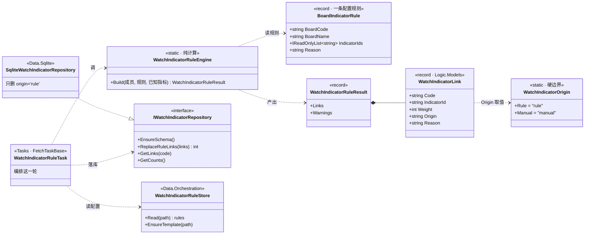
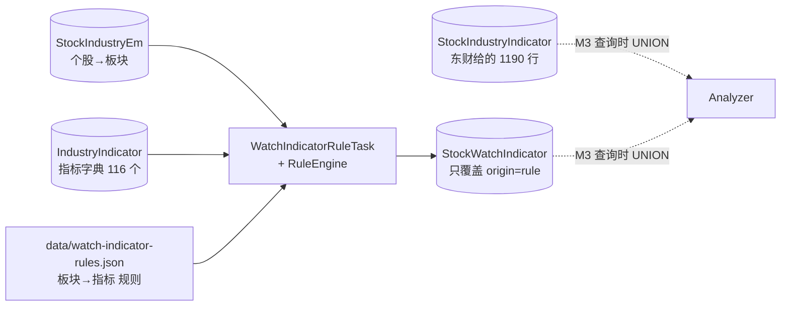

# 个股观察项（Watch Item）设计

> 2026-09-11 起草。要解决的问题：**"这只票该盯什么"每支不一样，靠人记会漏也会烂。**
> 相关：`project_core_position_layers`（底仓/主动仓两层）、`feedback_new_task_as_class`、
> `project_scheduler_redesign`、`doc/analysis-app-design.md` 3.5 自选股跟踪。

---

## 1. 三层的职责

分层依据不是粗细，是**知识来源**——谁知道这件事、谁来维护它。

| | L0 兜底 | L1 派生 | L2 手写 |
|---|---|---|---|
| 目标 | **不漏** | **不用维护** | **不噪音** |
| 知识来源 | 法规（披露规则枚举得完） | 结构（库里推得出来） | 私有（只有人知道） |
| 覆盖 | 全市场所有票 | 自选股，按画像 | 少数几只，≤3 项 |
| 谁维护 | 一次写死 | 规则，每次重算 | 人，**永不被规则覆盖** |
| 防的是 | 被机械事件打闷棍 | 环境变了自己不知道 | 论点被证伪了还拿着 |
| 失败模式 | 遗漏 | 清单腐烂 | 变许愿池 |

**为什么不能合并：**

- L0 合进 L1 → **会漏**。L0 是"所有票都有"，做成按画像挂，就会有票的画像没覆盖到、解禁日静默过去。这类事件成本不对称：盯着不烦，漏掉很贵。
- L1 合进 L2 → **会烂**。手工清单没人更新。回购方案实施完毕后就不该再盯，**这个摘除动作人一定会忘**。L1 的核心价值不是"挂上"，是**自动摘掉**。
- L2 合进 L1 → **会瞎**。已验证：`StockIndustryIndicator` 有 658 只票的东财自动映射，但锂电池板块 33 只里只有 1 只挂了指标、碳酸锂指数只挂给 6 只上游矿股。自动派生给不出"中游对上游价格的敏感度"——那是判断，不是结构。

**准入判据**（三条全过才进）：

1. **可判定**——能落成 `(取值器, 表达式, 阈值)`。"关注政策"不行，"存货/营收 > 50%"行。
2. **能改变动作**——触发后加/减/清会变。不改变动作的是噪音。
3. **有归属层**——底仓项和主动仓项分开，否则信号互污（见 `AnalyzerPaths.CorePositionPath` 注释里那三条理由）。

---

## 2. 从三层推出机制：每个新东西各解决哪一层的难点

这一节是设计的主干。下面每一张表、每一个字段，都只为了解决某一层的**一个**具体难点；不对应任何难点的东西不该存在。

| 层 | 它的难点具体是什么 | 机制 | 为什么非得这样 |
|---|---|---|---|
| **L0 不漏** | 已经没有难点了 | **零新增**，只加一个扫描器 | 事件表（`ShareLift` `EarningsForecast` `EarningsSchedule` `Dividend` `HolderChange` `Lhb`…）**已经全市场落库**。L0 要的"所有票都扫一遍"现在就能做，缺的只是读它们的代码（取值器 `EventTable`），不缺数据、不缺表 |
| **L1 不用维护** | ①"该挂什么"要能算出来 | 板块→指标的**配置化规则** | 写死在代码里，改一条要重编译 |
| | ②**"该摘了"要能被看见** | `PlanAnnouncement.stage` | ← **这才是那张表存在的理由**。方案的生命周期不落成结构化状态，程序就永远不知道回购已经结束、该把这条观察项摘掉；而摘除动作人一定会忘。**表不是为了记录回购，是为了让 L1 能自动摘** |
| | ③规则重算会跟东财打架 | `StockWatchIndicator` 独立表 | 东财 `ReplaceLinks()` 是 `DELETE FROM` 整表替换；L1 也要"每轮重算"。**两个都想当这张表的主人**，只能各占一张，查询时 UNION |
| **L2 不噪音** | ①手写的会被规则冲掉 | `WatchItem.Origin` 硬边界 | 跟 ③ 是同一个病的第二次发作：派生项整组重建、手写项任何规则不许碰 |
| | ②不可判定的项无处可去 | `Manual` 取值器 + `notes/{code}.md` | 没有出口，人就会把"盯一下政策"硬塞成自动项，然后它永远不触发、也永远没人发现它坏了 |

**读法**：整个设计只有三个真正的新东西——`PlanAnnouncement`、`StockWatchIndicator`、`Origin`——它们分别是 L1 的"自动摘"、L1 的"重算不打架"、L2 的"不被冲掉"。其余全是已有零件的组装。

### 2.1 四类数据，别混

最容易混的是把"事实"和"待办"当成一张表。它们的增删语义正好相反：

| 类别 | 是什么 | 表 | 增删语义 |
|---|---|---|---|
| **事实** | 客观发生了什么 | `PlanAnnouncement`、`ShareLift`、`Bar`、`IndustryIndicatorValue` | **只增不删** |
| **关系** | 谁该看谁 | `StockWatchIndicator` | 规则重算时整组重建 |
| **待办** | 我要盯什么 | `WatchItem` | 挂 / 摘 |
| **触发** | 盯到了什么 | `WatchHit` | 只增 |

**L0/L1/L2 分的不是表，是 `WatchItem` 里每一条的来源。** 三层全部落在 `WatchItem` 一张表里，靠 `Origin` 列区分；`PlanAnnouncement` 和 `StockWatchIndicator` 不是"某一层"，是**支撑 L1 干活所需的两块数据**。

⚠ `PlanAnnouncement` **永不删**。方案结束了要摘掉的是 `WatchItem` 那一条，不是事实表的行——删了就没法回溯"当初方案说的上限是 573"、也没法对账"进展公告拖了几个月"。

### 2.2 拿宁德走一遍

| 步 | 发生什么 | `PlanAnnouncement`（事实） | `WatchItem`（待办） |
|---|---|---|---|
| 1 | 2026-07 发回购方案 | **+1 行** `stage=方案, plan_cap_price=573` | — |
| 2 | L1 规则跑 | 不变 | **挂一条** `Origin=派生, Kind=PlanStage, A 档, AutoExpireOn="stage=完毕"` |
| 3 | 8/4、9/3 进展公告 | **+2 行** `stage=进展, cum_amount=0` | 不变 |
| 4 | 每日求值 | 不变 | 读最新行 → 仍是"进展"且金额 0 → 不触发，进日报 |
| 5 | 某天出现首次回购 | **+1 行** `stage=首次回购` | **触发** → 写 `WatchHit` → A 档推送 |
| 6 | 将来 `stage=完毕` | **+1 行**（前面 5 行一条不删） | L1 下轮重算 → **摘掉这条** |

第 6 步就是 L1"自动摘"的全部含义——**摘的是待办，不是事实**。

### 2.3 顺带解释 Fetcher / Analyzer 那条分界线

分界线不是按层切的，也**不是按"客观 / 主观"切的**——那样会把"宁德该看碳酸锂指数"判给 Analyzer，是错的。

真正的分界线是**这条知识属于标的，还是属于我**：

| | 关于标的 → Fetcher / `current.sqlite` | 关于我的仓位和判断 → Analyzer |
|---|---|---|
| L0 | 事件数据（全市场都抓） | 扫描哪些票 |
| L1 | `PlanAnnouncement`、指标序列、**`StockWatchIndicator`** | 规则触发后挂/摘哪条待办、持仓层判断 |
| L2 | — | 全部 |

**"锂电池厂该看碳酸锂价"是关于标的的领域知识**——它确实是判断不是事实，但换个人来用完全一样，也跟我持不持有宁德无关。这种知识归 `current.sqlite`，还有个实际好处：它引用的两端（`StockIndustryEm`、`IndustryIndicator`）都在那个库里，查询能一条 SQL 做完。

**"我拿着宁德，论点是回购为转折点"才是关于我的**——换个人就全不一样，归 Analyzer。

所以**同一层会横跨两侧**，而且 L1 的重心在 Fetcher 侧，不在 Analyzer 侧。

---

## 3. 架构切分：抓在 Fetcher，判在 Analyzer

| 侧 | 职责 | 读 | 写 |
|---|---|---|---|
| Fetcher | 抓**原始事件数据**（方案类公告、行业指标） | 外部数据源 | `current.sqlite` |
| Analyzer | **求值观察项**、产出触发 | `current.sqlite`（只读）+ 自己的 json | 自己的 json |

两条理由：

1. **Fetcher 不知道自选股**。`watchlist.json` / `core-positions.json` 是 Analyzer 的本地状态，在 `AnalyzerPaths.BaseDir` 下，Fetcher 侧看不到也不该看到。
2. **"该盯什么"天天改，不该引起重抓**。求值放 Analyzer，改一条观察项不碰抓取计划；抓取只管把原始事实存全。

---

## 4. 数据模型

### 4.1 Fetcher 侧：`current.sqlite` 新增两张表

#### `PlanAnnouncement` — 方案类公告进展（回购/定增/重组）

```
code           TEXT    6 位码
plan_kind      TEXT    回购 / 定增 / 重组
announce_date  TEXT    公告日
stage          TEXT    方案 / 首次回购 / 进展 / 达标 / 完毕 / 终止
as_of_date     TEXT    ★ 数据截止的交易日（月度进展是"截至上月末"，≠公告日）
cum_shares     REAL    累计回购股数
cum_amount     REAL    累计回购金额（元）
price_low      REAL    区间最低成交价
price_high     REAL    区间最高成交价
pct_of_capital REAL    占总股本比例
plan_cap_price REAL    方案价格上限（stage=方案 时才有）
title          TEXT
art_code       TEXT
source_url     TEXT    巨潮 PDF 链接
fetched_at     TEXT
PRIMARY KEY (code, plan_kind, announce_date, stage)
```

设计点：

- **`stage` 必须分开存**。"方案"的金额上限和"进展"的累计金额是两个量纲，混在一列对不上账。
- **`as_of_date` 独立于 `announce_date`**。按 `feedback_trading_date_not_write_date`，月度进展公告说的是"截至上月末"，值所属交易日不是公告日。
- **失败语义＝累积**（不是快照）。一只票抓失败不影响其余，没有"整项放弃"的必要——跟 `IndustryIndicatorTask` 的"序列"那一步同类。

#### `StockWatchIndicator` — 我们自己的个股→行业指标映射

```
code         TEXT
indicator_id TEXT    指向 IndustryIndicator.indicator_id
weight       INTEGER 展示序，越小越相关
origin       TEXT    rule / manual
reason       TEXT    为什么挂（人读）
created_at   TEXT
PRIMARY KEY (code, indicator_id)
```

**⚠ 这是本设计里最容易踩的坑：绝对不能往 `StockIndustryIndicator` 里补映射。**
`SqliteIndustryIndicatorRepository.ReplaceLinks()` 里是 `DELETE FROM StockIndustryIndicator;` 后整表重写——东财目录是**快照替换**，下一轮 `IndustryIndicatorTask` 跑完，手工补的映射会被静默清空，而且界面上看不出来（只是某只票"恰好没有指标"）。

所以：**东财那张表保持原样不动**（维持快照语义），我们的映射单独一张表，查询时两张 UNION、我们的优先。

### 4.2 Analyzer 侧：`BaseDir/watch/` 目录

跟 `watchlist.json` / `core-positions.json` / `notes/` 并列，理由同 `AnalyzerPaths` 类注释——这是 Analyzer 自己的状态，不是 Fetcher 的共享只读数据。

| 文件 | 内容 |
|---|---|
| `watch/items.json` | 观察项定义（L1 派生结果缓存 + L2 手写） |
| `watch/hits-{yyyy}.json` | 触发记录，按年切 |

用 json 不用新开 sqlite：A 档触发一年也就几十条，量级跟 `trade-fees.json` 同级；Analyzer 侧已有一整套 json store 的惯例（`JsonWatchlistStore`），不值得为此引入第二个数据库文件。

`WatchItem` 字段：

```
ItemId       Guid
Code         string
Layer        string   L0 / L1 / L2
Origin       string   兜底 / 派生 / 手写      ← 边界，见下
PositionKind string   主动仓 / 底仓 / 无仓位
Kind         string   取值器类型，见 4.3
Expr         string   取值参数（如 indicator_id、metric_key）
Op           string   lt / gt / cross_down / stage_change / ...
Threshold    double?
Priority     string   A / B / C
Enabled      bool
AutoExpireOn string?  自动摘除条件（如"方案 stage=完毕"）
Thesis       string?  L2 才有：一句话论点
CreatedDate  string
```

**`Origin` 是这套东西能不能长期用下去的关键**：派生项（`origin=派生`）每轮规则重算时整组重建，手写项（`origin=手写`）**任何规则都不许碰**。这条边界不划清，规则跑一次就把人写的冲掉了——跟 3.1 那个 `ReplaceLinks` 坑是同一个病。

### 4.3 取值器（`Kind`）

| Kind | 数据来源 | 例子 |
|---|---|---|
| `PlanStage` | `PlanAnnouncement` | 回购 stage 跃迁到"首次回购" |
| `IndustryIndicator` | `IndustryIndicatorValue` | 碳酸锂指数跌破 N |
| `FinMetricQoQ` | `FinancialReport` | 单季毛利率环比再降 |
| `FinMetricRatio` | `FinancialReport` | 存货/营收 > 50% |
| `PriceMA` | `Bar` | 跌破 MA20 |
| `MarginBalance` | `MarginDetail` | 融资余额环比 |
| `HolderCount` | `ShareholderCount` | 股东户数环比降 |
| `EventTable` | `ShareLift` / `HolderChange` / `EarningsSchedule` / `EarningsForecast` / `Dividend.progress` | 解禁日临近、预告发布 |
| `Manual` | **无数据源**，到点提醒人去查 | 月度装车份额 |

#### ⚠ `IndustryIndicator` 取值器的口径坑：指标值是**自然日序列**，不是交易日序列

实测 `EMI00662659`（碳酸锂指数）：

```
09-04 周五  377.07
09-05 周六  377.07   ← 沿用
09-06 周日  377.07   ← 沿用
09-07 周一  356.69
09-09 周三  351.59
09-10 周四  351.59   ← 工作日里也常连续同值（生意社不是每天出新数）
```

所以 **"值没变" ≠ "没更新"**。求值必须：① 按交易日过滤（拿 `TradingDay` 当锚）；② 环比跟**上一个不同值**比，不是跟上一行比。直接写"较上一日跌 X%" 会在周末恒等于 0，且分不清"真没动"和"没发布"。

**`Manual` 是必要的诚实出口**，不是偷懒：有些关键变量库里确实没有（见 §7）。让它显式存在，好过假装能自动判、或者把它排除在系统之外让人忘掉。`Manual` 项只产出"该去查了"的提醒，不产出"已触发"的结论。

### 4.4 L2 与个股笔记的关系

`notes/{code}.md` 已经在承担"下次要盯什么"这类判断的留档（见 `AnalyzerPaths.NotesDir` 注释："数据能重算，判断不能"）。**不另造一套论点编辑 UI**：

- 笔记 `.md` 里写**论点全文**（给人读，能进 git、能贴表格）
- `watch/items.json` 里存**可判定条件**（给机器读），`Thesis` 只存一句话摘要
- UI 上同屏显示，不做双向同步——双向同步会立刻产生"以哪边为准"的问题

---

## 5. L1 派生规则（M1 的具体内容）

规则表配置化（JSONC，按 `feedback_config_self_documenting`）：

| 触发条件 | 挂什么 | 摘除条件 |
|---|---|---|
| 存在 `PlanAnnouncement.stage=方案` 且未完毕 | `PlanStage` 进展监控，A 档 | stage 到"完毕/终止" |
| 属于板块 BK1303（锂电池）等 | 对应 `IndustryIndicator`，B 档 | 不再属于该板块 |
| 在 `core-positions.json` 里 | 分红方案变化、股息率，B 档 | 移出底仓 |
| 在 `watchlist.json` 里 | 跌破 MA5/MA20、融资余额、龙虎榜，B 档 | 移出自选 |
| 存货/营收 连续两期上升 | `FinMetricRatio` 存货比，B 档 | 连续两期回落 |
| 行业属于银行/券商/保险 | `BankRegulatoryMetric` 相关项 | — |

板块→指标的映射表先写成配置，**不写死在代码里**——它会随认识变化频繁调整，改一条要重编译不可接受。

---

## 6. 类设计与改动清单

### 6.1 M1 的类图

**M1 全部落在 Fetcher 一侧，Analyzer 一行不改**（理由见 §2.3：这是关于标的的知识）。



### 6.2 各类职责与"为什么是它"

| 类 | 项目 | 职责 | 为什么单独存在 |
|---|---|---|---|
| `WatchIndicatorLink` | Logic.Models | 一行"这票该看这指标" | 跟东财的 `StockIndicatorLink` **是两个类型**，不能复用——两者归属不同的表、不同的主人 |
| `WatchIndicatorOrigin` | Logic.Models | `rule` / `manual` 常量 | 这两个字符串散在各处写字面量，早晚拼错一个，而拼错的后果是**手挂的行被当成规则行删掉** |
| `BoardIndicatorRule` | Logic.Models | 一条配置规则 | 配置的形状要能被单测直接构造，不能只存在于 json 解析里 |
| `WatchIndicatorRuleEngine` | Logic.Services | 板块规则 → 个股行，**带校验** | 纯计算无依赖 ⇒ 可单测。**校验失败要告警不能静默跳过**，理由见下 |
| `IWatchIndicatorRepository` | Logic.Abstractions | 存取契约 | 任务只依赖接口，测试不必起 SQLite |
| `SqliteWatchIndicatorRepository` | Data.Sqlite | 实现 | **`ReplaceRuleLinks` 只删 `origin='rule'`**——整个设计的关键一行 |
| `WatchIndicatorRuleStore` | Data.Orchestration | 读 JSONC 配置 + 首次写自带说明的模板 | 按 `feedback_config_self_documenting`，跟 `FetcherSettings` 同一套路数 |
| `WatchIndicatorRuleTask` | Tasks | 编排：读板块成员 + 读指标字典 + 读规则 → 引擎 → 落库 | 按 `feedback_new_task_as_class`，不堆进 `FetchOrchestrator` |

### 6.3 数据流



**零网络请求**：三个输入全在本地库和本地配置里。这也是 M1 能零联网验证的原因。

### 6.4 三个关键决定

**① 引擎校验失败 = 逐条跳过 + 告警，不是整项放弃。**
配置里把 `EMI00662659` 写错一个字母，结果是这条规则一行都不产出；而"没产出"跟"这个板块本来就没成分股"在库里长得一模一样——**没人会发现配置坏了**。所以指向不存在的板块/指标一律进 `Warnings` 并打进日志。

这跟【行业景气指标】那边"目录拿不全就整项放弃"是**有意的不同**：那边是快照，半批入库等于凭空少票；这边是派生，一条规则坏掉不该连累其余。

**② 同一只票被多条规则命中，保留先命中的。**
宁德同时在"电池(BK1033)"和"锂电池(BK1303)"里。配置顺序即优先级，**越靠前越具体**，后面的不覆盖前面的。

**③ `ReplaceRuleLinks` 是"只删自己那部分"的替换。**
不是 `DELETE FROM StockWatchIndicator`——那会连人手挂的一起删。这跟东财 `ReplaceLinks` 的全表替换是**故意的不同**，因为这张表有两个主人（规则和人），而东财那张只有一个。

---

### 6.5 改动清单

### Fetcher 侧

| 文件 | 动作 | 说明 |
|---|---|---|
| `SqliteSchema.cs` | 改 | 加 `PlanAnnouncement`、`StockWatchIndicator` 两张表 |
| `StockPlatform.Logic/Models/PlanAnnouncement.cs` | 新增 | 模型 |
| `StockPlatform.Logic/Abstractions/IPlanAnnouncementRepository.cs` | 新增 | |
| `StockPlatform.Data/Sqlite/SqlitePlanAnnouncementRepository.cs` | 新增 | |
| ~~`CninfoStockAnnouncementProvider.cs`~~ | **撤销** | 见 §6.6：两条现成通道够用，不新写 provider |
| `StockPlatform.Logic/Services/PlanAnnouncementExtractor.cs` | 新增 | 从正文抽 stage / 累计数 / 价格区间，参照 `OrderWinExtractor` |
| `StockPlatform.Tasks/PlanWatchTask.cs` | 新增 | 继承 `FetchTaskBase<PlanAnnouncement>` |
| `FetchActionId` | 改 | 加 `StepPlanWatch` |
| `FetchTaskCatalog.cs` | 改 | 注册一行 + `PlanGroupKind.Daily` + 执行顺序 |
| `App.xaml.cs` | 改 | DI 一行 |

**为什么新写 provider 而不复用现有那个**：按 `feedback_datasource_per_class`，一个通道一个类。两者形状不同——现有的是全市场关键词检索（一次覆盖所有票、适合日频发现），新的是按股票拉公告列表（几十个请求、可一天跑多次）。共享的 HTTP/限流/解析抽基类。

**任务形状**（对照 `IndustryIndicatorTask` 的两条铁律）：

- 一批 = 一只票的公告解析结果；水位线 = 每只票自己的 `MAX(announce_date)`。**水位线粒度（票）细于骨架截断粒度（批＝票）**，所以不需要额外的完成度表。
- 失败语义 = **累积**。单票失败不影响其余，不做"整项放弃"。

**调度**：`PlanGroupKind.Daily`，非交易日不跑（准入归调度侧）。

> ⚠ **实现与初稿不一致，这里是现状**（2026-09-11 修正）。
>
> 初稿写的是"跑两次——08:15 赶在开盘前 + 收盘后兜底"。**实现没做到，也不该由这一项来做**：
> 任务只声明自己属于哪个组，**一天跑几次、几点跑是计划页的事**（`project_scheduler_redesign`：
> 时机归调度侧）。初稿那句话越过了这条边界。
>
> 默认日更组是 `NotBefore = 18:00`，于是：
>
> | 公告发布时段 | 实际知道的时间 |
> |---|---|
> | T 日 18:00 前 | T 日晚 |
> | T 日 18:00–22:00（常见） | T+1 晚 |
> | T+1 早 07:00–08:30（常见） | **T+1 晚——错过 T+1 整个交易日** |
>
> 而这一项的卖点正是"T+1 开盘前拿到"。挂 18:00 等于降级成"T+1 收盘后知道"：
> 信息不丢，**行动窗口少一天**。
>
> **想要开盘前的信号**：在计划页新建一组 `NotBefore=08:15`、只放这一项即可，零代码——
> 早间那一跑只有 14 天增量、几分钟，不跟任何东西抢配额。
> 不做也行：自动摘除、方案台账、进展对账这些不受影响。
>
> **不建议**为这一个任务去改调度侧的组模型（让单个任务支持一天多次触发），
> 那动的是所有任务共用的结构，代价远大于收益。

### Analyzer 侧

| 文件 | 动作 |
|---|---|
| `AnalyzerPaths.cs` | 改：加 `WatchDir` |
| `Analyzer/Watchlist/WatchItem.cs`、`WatchHit.cs` | 新增：模型 |
| `Analyzer/Watchlist/JsonWatchItemStore.cs` | 新增：参照 `JsonWatchlistStore` |
| `StockPlatform.Logic/Services/WatchRuleEngine.cs` | 新增：L1 派生（挂 + 摘） |
| `StockPlatform.Logic/Services/WatchEvaluator.cs` | 新增：按 `Kind` 分发求值 |
| `ViewModels/` + 新页 | 新增：观察项列表 / 触发提醒 |

---

### 6.6 M2 修正：不新写 provider，复用两条现成通道

原计划新写一个"按股票查公告列表"的 provider。**撤销**，改用已有的两条（`OrderWinAnnouncement` 那条管线在用，已验证）：

| 步 | 复用 | 为什么 |
|---|---|---|
| 发现 | `IAnnouncementSearchProvider`（巨潮全市场标题检索，关键词「回购」） | **一次分页覆盖全市场**，比按股票查几十个请求更省，而且**更全**——自选股之外新冒出来的回购方案也能捕获 |
| 正文 | `IAnnouncementDetailFetcher`（东财，直接给纯文本） | 绕开 PDF 解析；已有实现 |

原方案基于"要一天跑多次、只盯自选股"的假设。但既然全市场一次就够，按股票查就没有存在理由了；而且新接口要沙箱验证，现成这两条已经在生产里跑着。

**⚠ 复用带来的一条硬约束：必须按天切片搜索**（2026-09-11 实机跑出来的）

`CninfoAnnouncementSearchProvider` 有 `MaxPages = 30` 的硬上限。而「回购」是高频关键词——
实测 14 天一次搜**正好撞满 30 页（285 条）就 break，剩下的静默丢掉、没有任何告警**。

```
[12:31:04] [巨潮全文检索] 关键词"回购" 第 30 页，累计 285 条命中   ← 正好停在上限
```

漏掉的公告就是漏掉的信号，而这一项的全部价值就是不漏掉「首次回购」那一条。
所以 `PlanWatchTask` 自己**按天循环调 SearchAsync**，单日只有几页、撞不到上限；
总请求数反而差不多（页数是一样的）。单日命中数接近上限时还要**再告警一次**。

这跟 `project_em_sort_key_must_be_unique` 记的是同一类病：**分页截断不报错**，
少掉的那半没有任何迹象。中标公告那条管线用的是低频关键词所以没暴露，不代表上限不存在。

### 6.7 抽取规则（拿真实公告归纳，不是猜的）

取了 4 家 5 份真实公告正文作为依据（宁德 300750、美的 000333、格力 000651）。

**`stage` 判定：标题定类型，正文定数值**

| 标题特征 | stage | 实例 |
|---|---|---|
| 含「方案」「报告书」 | `方案` | 宁德《关于回购公司股份方案的公告暨回购股份报告书》 |
| 含「首次回购」 | `首次回购` | 格力《关于以集中竞价方式首次回购股份暨回购股份进展的公告》 |
| 含「达总股本」「达到总股本」 | `达标` | 美的《…回购A股股份达总股本1%的进展公告》 |
| 含「进展」 | `进展` | 宁德/美的《…回购…进展情况的公告》 |
| 含「完毕」「实施完成」「期限届满」 | `完毕` | |
| 含「终止」 | `终止` | |

**⚠ 必须排除的干扰项**：标题形如《关于回购股份事项**前十名股东和前十名无限售条件股东持股情况**的公告》——
宁德和格力都有。它标题含「回购」、也含不了「进展」，但内容是股东名册，跟回购进度毫无关系。
不排除的话会被解析成一条各字段全空的"进展"，**看起来像回购停滞**。这是本项唯一会产生**错误结论**（而非漏数据）的坑。

**正文句式**（三种，都实测过）：

```
① 已实施（美的 2026-09-03）
截至2026年8月31日，公司通过回购专用证券账户，以集中竞价交易方式累计回购公司A股股份
数量为99,797,967股，占公司目前总股本的1.31%，最高成交价为87.71元/股，
最低成交价为73.66元/股，支付的总金额为8,019,722,850元（不含交易费用）

② 未实施（宁德 2026-09-03）
截至2026年8月31日，公司尚未实施股份回购。

③ 首次回购（格力 2026-08-19）——注意数字里有空格
公司于 2026 年 8 月 17 日至 2026 年 8 月 18 日以集中竞价方式累计回购股份数量为
495,600 股，占公司目前总股本的 0.0088%，最高成交价为 40.10 元/股，…
```

**两条从真样本才看得出来的实现约束**：

1. **数字和日期里会有空格**（格力那份：`495,600 股`、`2026 年 8 月 17 日`）——PDF 转文本的产物。
   所有正则必须 `\s*` 容忍，否则会**只对一部分公司生效**，而失败的那些看起来就像"这家没回购"。
2. **`as_of_date` 有两种写法**：「截至X日」直接取；「公司于 A 至 B」取区间末 B。

**方案公告另抽**（宁德 2026-07-25）：`回购价格上限为573元/股` → `plan_cap_price`；
`不低于人民币200亿元…不超过人民币400亿元` → 金额区间。

#### ⚠ 三家样本归纳不出全市场句式（2026-09-11 实机打脸）

上面那版正则拿宁德/美的/格力三家归纳，跑全市场 103 条真实进展公告**只抽到 18 条（17%）**，
而且 `art_code` 都有值——**正文是取到了的，是正则不匹配**。实测到的变体：

| 真实原文 | 原正则要求 | 差在哪 |
|---|---|---|
| 公司**尚未开始实施**股份回购 | `尚未(实施\|开始\|进行)(股份)?回购` | 中间多一个词 |
| **回购公司股份**206,000**股** | `累计回购…股份数量为N股` | 没有「累计…数量为」 |
| **成交总金额**为**人民币**1,863,178元 | `支付的?总金额为N元` | 换了动词、多了「人民币」 |

改法是**每条按「骨架词 + 可选修饰」写**，不把某一家的措辞当通例：
`回购(公司)?([A-Za-z]股)?股份(的)?(数量)?(为|共计|合计)?\s*N\s*股`。

**这条教训比那几条正则本身重要**：中文公告没有统一模板，靠少数样本归纳出来的抽取规则
会**静默地只对一部分公司生效**——而失败的那些在库里长得就像"这家没在回购"。
所以这类抽取必须**先跑全市场、用覆盖率当验收指标**，不能测几条样例就算过。

---

## 7. 已知缺口（设计阶段就说清，不留到实现时才发现）

| 观察项 | 状态 |
|---|---|
| 回购进展 | ✅ 可自动，本设计覆盖 |
| 碳酸锂指数 | ✅ 数据已在库（`EMI00662659`，生意社，日频），**只差映射**，零新增请求 |
| 单季毛利率环比、存货/营收 | ✅ `FinancialReport` 够算 |
| **月度动力电池装车份额** | ❌ **库里没有**。来源是中国汽车动力电池产业创新联盟月度数据，现有任何表都不含。要么新增数据源（另立设计），要么降级为 `Manual` |
| 锂电池消费税等政策节点 | ❌ 无结构化源，只能 `Manual` |

讨论阶段把"装车份额 < 45%"列成 A 档自动观察项是不成立的——**现阶段它只能是 `Manual`**。

**已排查**：`IndustryIndicator` 里中汽协那一路 12 个指标（`EMI00100216` 全国汽车销量、`EMI00225489/225497/225508/225522/1633900/1633912` 当月汽车产销量、`EMI00225598/225610` 客车产销量、`EMI00225624/225648` 汽车总产销量）**全是整车产销口径，没有一个是电池装车**。整车销量是行业总需求，跟"宁德在电池里占多少份额"是两件事——份额掉了而整车销量涨着，这个指标一点信号都不给，不能拿来顶替。

**另一条能力边界**：月频指标只有 30 行（2024-03 起），**历史只有两年半**。当环境监控够用，**做回测不够**——别拿它进 FactorLab。

### 现状确认（2026-09-11 查）

| 表 | 现状 |
|---|---|
| `IndustryIndicator` | 116 个指标：月 55 / 日 45 / 周 14 / 旬 1 / 半年 1 |
| `IndustryIndicatorValue` | 30230 行，2024-03-01 ~ 2026-09-10，116 个指标全有值 |
| `StockIndustryIndicator` | 1190 行 / 658 只票，由 `IndustryIndicatorTask` 日更 |
| `EMI00662659` 碳酸锂指数 | 891 行，生意社，日频，最新 2026-09-10 = 351.59 |

**M1 要做的只是补 `300750 → EMI00662659` 这类关系行，零新增请求。**

---

## 8. 分期与验证

| 期 | 内容 | 验证 |
|---|---|---|
| **M1** | `StockWatchIndicator` 表 + L1 板块→指标映射规则 + 配置 | 宁德挂上碳酸锂指数；**再跑一次 `IndustryIndicatorTask`，映射仍在**（证明没被 `ReplaceLinks` 冲掉）；`dotnet test` |
| **M2** | `PlanAnnouncement` + `PlanWatchTask` | Debug 数据目录（天然隔离）跑一轮，能抓到宁德 2026-07 回购方案 + 8/4、9/3 两份进展，`stage` 分得对、`as_of_date` 是"截至上月末"不是公告日 |
| **M3** | Analyzer 侧求值 + UI | 实机跑（`feedback_verify_by_running_app`）：Debug 起 Analyzer + UIAutomation 点按钮读日志 |

M1 不依赖 M2，可以单独上——数据已在库，是三期里唯一零联网就能验证的。

### M1 已完成（2026-09-11）

单测 9/9 通过（全量 1093 全过）。Debug 实机验证（UIAutomation 点【观察指标映射】的【执行】，
零联网；Debug 数据目录灌入真库的 `StockIndustryEm` 16935 条 + `IndustryIndicator` 116 个）：

| 验证 | 结果 |
|---|---|
| 规则 2 条 → 算出 **107 条映射覆盖 107 只票** | 跟离线跑真库数据的结果一字不差 |
| 宁德时代挂上 `EMI00662659` | `weight=1, reason="锂电池：碳酸锂是主要原材料成本"` |
| 一票多规则（BK1303 vs BK1033） | BK1303 赢——配置顺序即优先级 |
| 故意写错指标码 `EMI_TYPO_999` | **日志逐条告警**，且不连累其余 107 条 |
| ★ 重跑后手挂的 `origin=manual` 行 | **2 条全部活下来** |
| ★ 规则撞上手挂的同一条 | 保留手挂的（`rule` 重建为 106） |
| ★ 东财 `ReplaceLinks` 跑完我们的映射还在 | `rule=1→1`、`manual=1→1`（临时库交叉验证） |
| ★ 我们的 `ReplaceRuleLinks` 不动东财那张表 | `1→1` |
| 首次跑（模板全注释） | 产出 0 行，不改动映射 |
| 配置坏文件 | 0 条 + 告警，不抛、不清空 |

打 ★ 的四条是这套设计要躲的那个坑的实证。推理上两张表动不了彼此，
但"推理上不会"正是这类静默事故的标准开场白，所以都真跑了一遍。

### M2 / M3 已完成（2026-09-11）

单测 1162 全过（新增 69 条）。端到端实机：Debug Fetcher 抓真实公告 → Debug Analyzer 求值。

**M2 抓取**（UIAutomation 点【回购公告进展】，真连巨潮 + 东财）：

| 指标 | 结果 |
|---|---|
| 单日命中 → 真回购公告 | 61 → 10（四轮收紧：48 → 13 → 10） |
| 取到正文 | 95% |
| 进展类字段抽取率 | 股数 90% / 金额 80% / 占比 100% / 价格 80% |
| 单位换算 | 九洲药业「123.25 万股」「1,524.73 万元」→ 1,232,500 股 / 15,247,300 元 ✅ |

**M3 求值**（UIAutomation 点【观察项】→【重算并求值】）：

```
观察项 15 条（新挂 14、摘掉 0）；求值 15 条，命中 3 条

[A] 2026-08-31 宁德时代  回购方案进行中（2026-07-25 公告，价格上限 573 元）
                         → 现状：进展（尚未实施）
[A] 2026-09-11 宁德时代  【需人工核对】月度装车份额跌破 45%（库里没有这个数据源）
[B] 2026-09-10 宁德时代  碳酸锂：356.69 → 351.59（-1.4%）
```

三条正好覆盖三层：L1 派生（回购 stage）、L2 手写（Manual 诚实出口）、L1 派生（行业指标）。
触发日期是**值所属交易日**（08-31）而非公告日（09-03），口径正确。

**★ 自动摘除实机验证**——往库里插一条「完毕」公告再重算：

```
观察项 14 条（新挂 0、摘掉 1）
  PlanStage 观察项: 0 条   ← 方案完毕，自动撤下
  手写项:     1 条         ← 没被误伤
  行业指标:   1 条         ← 没被误伤
  触发记录:   3 条         ← 只增不删，摘待办不动事实
```

这是 L1 存在的全部理由：**摘的是待办，不是事实**，而且人一定会忘的那个动作由规则代劳了。

### 实机才暴露、单测测不出的四个问题（都已修）

| 问题 | 后果 | 修法 |
|---|---|---|
| 巨潮 `MaxPages=30` 静默截断 | 14 天一次搜正好撞满 285 条就 break，**剩下的没有告警** | 按天切片搜索 + 接近上限时告警 |
| 三家样本归纳的正则 | 跑全市场只抽到 **17%**，失败的在库里像"这家没在回购" | 按"骨架词+可选修饰"重写，覆盖率当验收指标 |
| 数量带「万」单位 | 抽出小 10000 倍**但看起来完全正常**的数 | `NU` 模式 + `ScaledNum` 换算 |
| `ClassifyStage` 兜底当「进展」 | 土地回购/提议回购/贷款承诺全落进进展类，**看起来像回购停滞** | 认不出明确 stage 的一律不收 |

**共同点：四个全是"不报错但结论错"的坑**，单测按自己想象的样本写永远测不到——
必须跑全市场、拿覆盖率当指标。

---

## 8.1 M4 叙述式改版（2026-09-14）

### 为什么改

M3 的观察项页是左右两张表，**按事项**组织：左＝预计要发生，右＝已经发生。
分界线本身没问题（同一件事不会两边都出现），但用起来是这样的——

> 从左边看到事件了，要去右边找是否成了事实，如回购。

**一件事被拆在两处。** 回购尤其明显：方案在左、买到哪一步在右，
而"到底买了没"恰恰是当初做这整套东西的起点问题。

改成 **一只票一行、事件叙述**：

```
300750 宁德时代  A
  2026-07-25  回购方案  计划 200~400 亿，价格上限 573 元
     2026-09-03  回购进展  截至 08-31 尚未实施
     2026-09-11  首次回购  截至 09-11 累计 2 亿元
  2026-09-11  跌破 MA20  收盘 330.51，MA20 365.3，低 9.52%
  2026-08-04  分红方案  每10股派 14.11 元（实施），除权 2026-08-10
```

### 排序规则（用户定的）

| 层级 | 规则 | 为什么 |
|---|---|---|
| 行与行 | 按**离今天最近**的那件事排 | 不能按 `MAX(日期)`——解禁是日程表，库里躺着 2030 年的计划，那种票会稳居第一页，而它恰恰最不用管 |
| 事项与事项 | 按**主行**（第一行）那个日期倒序 | 人顺着主行那列日期读，它必须从上往下递减 |
| 事项内部 | 按日期**正序**，进展缩进一级 | 一件事的来龙去脉顺着时间读才通顺，倒着读"完毕→进展→首次"是反直觉的 |

⚠ **组间那条返工过一次**。第一版按"组内最新"排，理由是"上周刚买了一笔不该沉底"——
但屏幕上主行那列读出来是 `07-25 → 09-03 → 09-11 → 09-11 → 08-04`，**不单调**，一眼就是错的：

> 事件间的时间排序不对。事件内的时间排序是对的。

代价是接受了：回购方案 7 月发的，哪怕上周刚买，整组也排在 8 月的分红下面。
换来的是那一列日期读得通——**排序规则要能被一眼验证**，不能只在注释里成立。

### 行业指标：市场区和个股行**都显示**

碳酸锂指数在市场观察区有一条，同时也出现在每只锂电池股的行里，带上「为什么挂它」：

```
2026-09-11  碳酸锂指数 338.85（较 09-10 -3.62%）　— 锂电池：碳酸锂是主要原材料成本
```

谁受影响是 `StockWatchIndicator` 回答的（M1 的板块规则铺出来的）。
不这样做的话，看宁德的时候得先记住"碳酸锂跌了 3.6%"，再去另一个区确认它跟谁有关。

⚠ **指标在个股行里一律垫底，且不参与行序**（两处都要挡）：

| 挡在哪 | 不挡会怎样 |
|---|---|
| `WatchEventComposer` 组间排序 | 指标天天更新，按日期排就天天霸占这只票叙述的第一行，把回购、解禁顶下去 |
| `WatchService.Proximity` 行序锚点 | 全部 107 只锂电池股每天都是"距今 0 天"，整页行序被一条外部指标决定 |

判据是：它是**影响这只票的外部环境**，不是**这只票出了什么事**。
一只票要是只有指标事件，那就只能拿它当行序依据——总比没有次序强。

### 市场观察项单独分出来

"跌破 MA20"每只票都有，熊市里几千只同时触发，逐票列在个股行里没有区分度，
只会把真正个股独有的事淹掉。所以广度类的放右侧 Grid：

```
2026-09-11  全市场 4045 只跌破 MA20（占 73.1%，共 5531 只）
2026-09-11  碳酸锂指数 338.85（较 09-10 -3.62%）
```

⚠ **个股行里仍然保留自己那条 MA20** —— 持有它就要看自己的数；
市场观察给的是广度背景：今天是几千只一起跌，还是就它一只跌，含义完全不同。

### 详情合并进【分析详情】（2026-09-14 当天两次迭代）

**上午**：观察项做成独立窗口 `StockWatchWindow`，跟【财务分析】平级，三处可开。

**下午用户改了主意**：

> 个股的观察项和财务分析，在 UI 上放一个页面，这样一看就有了，也可对比数据。

⚠ 关键是他补的那句：**"我不是要合并财务分析和观察项，只是把这两个在 UI 上放一个页面，其他不变"**
——**合并是布局动作，不是内容动作**。我一开始提的"把财报结论也变成时间线事件"被明确否掉了。

最终布局（用户定的，分栏**从窗口最顶端开始**，两边互不跨越）：

```
┌────────────────────────────┬──────────────────────┐
│ 300750 宁德时代 · 2026年中报 │ 观察项    [分析笔记]  │
├────────────────────────────┤ 09-11 跌破 MA20 …    │
│ 需要留意的 N 项（固定不滚）  │ 07-25 回购方案 …      │
├────────────────────────────┼──────────────────────┤
│ 一、赚钱的规模 vs 效率       │ 趋势 8 期（自己滚）    │
│ 二、净利率掉在哪            │ 营业收入 / 归母净利…   │
│ 三、利润变现金（自己滚）     │                      │
└────────────────────────────┴──────────────────────┘
```

**三条设计判据**（每条都在某处踩过或算过）：

| 判据 | 为什么 |
|---|---|
| 右栏拆成**两个独立滚动区**，不是一个 | 往下滚看毛利率那张图时，观察项不能跟着滚走——"能对比"的前提正是其中一个**不会滚掉** |
| 观察项用 `Auto` 高度 + `MaxHeight 420`，不定高 | 实测宁德全部事件才 7 行（约 230px），定死 480 等于白占两百多像素、硬把趋势图挤下去 |
| 上面那条横幅收进左栏 | 它原来通栏，右半截长期空着——北京银行那种异常项多的票白掉 620×140 一整片，正好安置观察项 |

**趋势图不会被挤扁**：右栏本来就是 `ScrollViewer`，每张图固定高 128px（末张 165px），不是拉伸填充的。观察项放上面只是让图整体下移、滚得早一点，尺寸一点不变。

### 入口收敛成一个【分析详情】

13 个列表页的操作列、行情详情窗工具条，原来是【财务分析】+【观察项】两颗，现在一颗。
操作列宽从 252 缩回 **186**（比加观察项之前还省）。用泛称而不是「财务分析」，是因为窗口里确实两样都有。

**不再拦非个股**：以前指数/ETF 点了弹框说"没有财务报表"。现在右边还有观察项，
"没有财务但有事件"是个正常状态——左栏如实写一句就行，弹框挡在前面纯属添堵。

### 「已处理」标记整套删除

09-12 加的（`Handled` / `HandledAt` / `MarkHandled` / 详情窗的勾选），09-14 全删。

原因是叙述式改版之后**触发记录跟事件叙述高度重复**。实测宁德那 4 条：

| 日期 | 档 | 内容 |
|---|---|---|
| 09-11 | A | 进展（尚未实施）→ 首次回购（已回购 2 亿元） |
| 09-11 | B | 碳酸锂 351.59 → 338.85（-3.6%） |
| 09-10 | B | 碳酸锂 356.69 → 351.59（-1.4%） |
| 08-31 | A | 回购方案进行中 → 现状：进展（尚未实施） |

四条全是上面事件的另一种说法，唯一的增量信息只是"哪天报的警"。用户原话：**"全是重复，没意义"**。
那张表不显示了，标记也就没有对象。顺带清掉了 `WatchRunResult` 里的 `Detail` / `Progress` / `Priority`
——那是左右两表时代的产物，叙述式改版之后一直算着却没人读。

⚠ 历史 `hits-yyyy.json` 里仍有这两个字段，反序列化时忽略，不报错。

### 新类

| 类 | 职责 |
|---|---|
| `WatchEvent` / `StockWatchEvents` / `MarketWatchItem` | 叙述的数据形状（Logic/Models） |
| `BuybackTimeline` | 回购按轮拆分 + 叙述 + 折叠（纯计算，9 条判据） |
| `WatchEventComposer` | 组间排序 + 取最高档（纯计算，6 条判据） |
| `SqliteStockEventSource` | 各张表 → 事件（Data，只读） |
| `SqliteMarketWatchSource` | 全市场广度 + 行业指标（Data，只读） |
| `StockWatchPanel` | 单票观察项面板，嵌在【分析详情】右上角（原 `StockWatchWindow`，当天改成 UserControl） |

`SqliteWatchReadingSource` **保留不动**：它是给**求值**用的（取一个数、判要不要触发），
`SqliteStockEventSource` 是给**阅读**用的（把来龙去脉讲成人话）。
两者取同一批表但形状完全不同，合成一个会互相将就。

### 实机才暴露的三个问题（都已修）

| 问题 | 后果 | 修法 |
|---|---|---|
| 那一轮回购库里只有进展、没有方案（美的/格力——方案发在抓取窗口之前） | 整组全是缩进行，界面上是一截**悬空的缩进**：缩进的意思是"这是上一条的后续"，上面没有那一条 | 没有方案时把第一条执行提为主行 |
| 叙述里不设陈旧门槛 | 冒出"2016-01-21 业绩预告 略增"、"2021-02-18 龙虎榜"——那不是事件，是**十年没有过事件**，还排得跟今年的公告一样 | 按事项定门槛：预告 200 天 / 龙虎榜 180 天 / 增减持 365 天 / 分红 400 天；回购不设（整轮叙述本身有价值） |
| 全市场广度把 ETF 和指数算进分母 | 分母 7168，**比 A 股总数还多一千六**，占比不再是"全市场股票"的占比 | `LENGTH(code) = 6`——ETF/指数带市场前缀存（8 位），个股一律裸 6 位码 |

---

## 9. 不做什么

- **不做盘中实时**。回购没有法定盘中披露，资金流/大宗/席位都识别不出回购盘口。最快就是 T+1 开盘前，再快是假的。
- **不按事件频次反推该盯什么**。宁德近 2 年 `BlockTrade` 414 条、`Lhb` 和 `HolderChange` 各 0 条——高频的恰好最没用。
- **不做自由文本观察项**。不满足 §1 三条准入判据的写进 `notes/{code}.md`，不进系统。
- **不动 `StockIndustryIndicator`**，见 §4.1。
- **不合并 `watchlist.json` 和 `core-positions.json`**，理由见 `AnalyzerPaths.CorePositionPath` 注释。
